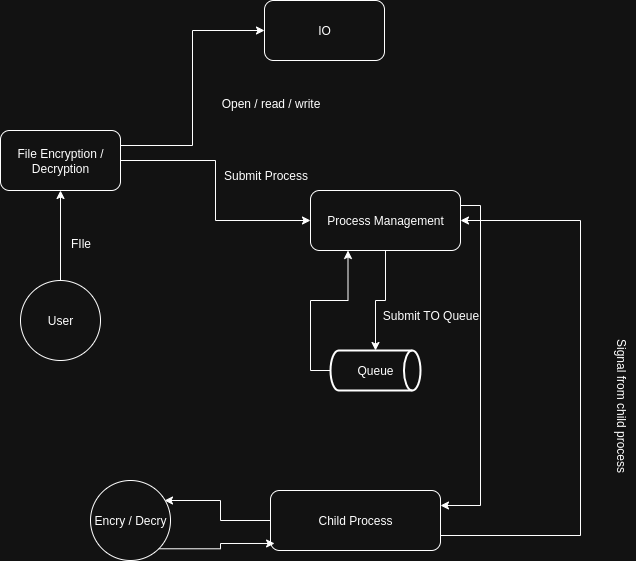
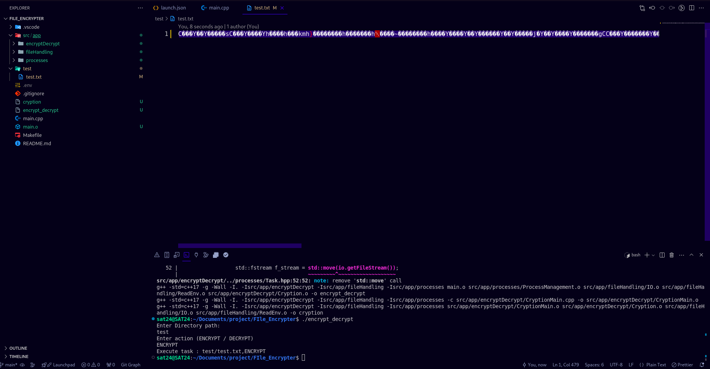
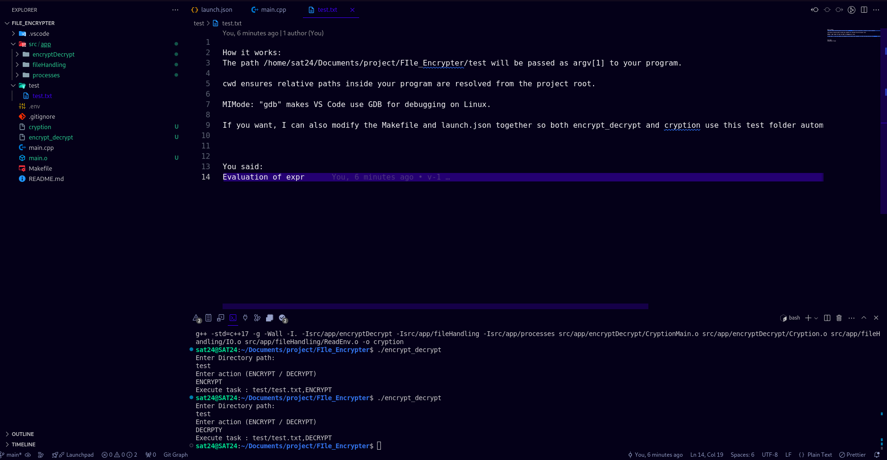

# 🔐 Fcrypt — A C++ File Cryptor

Fcrypt is a **file encryption and decryption tool** built in **C++**.  
It demonstrates secure file handling using `unique_ptr`, `fstream`, and `sstream`.  

⚡ While the current version is single-threaded, the project is designed with a roadmap towards **multiprocessing** and **multithreading** for improved performance.

---

## 📌 Overview

- **Encryption & Decryption** of files with a simple CLI interface.  
- Uses **C++ smart pointers (`unique_ptr`)** for safe memory management.  
- Leverages **fstream & sstream** for efficient file I/O operations.  
- Future scope:  
  - Multiprocessing (via `fork()`)  
  - Multithreading (via pthreads or `<thread>`)  

---

## 🖼️ Architecture



---

## 🔑 How Encryption Works

  

---

## 🔓 How Decryption Works

  

---

## 🛠️ Tech Highlights

### ✅ `unique_ptr`  
- Smart pointer that owns and manages a dynamically allocated object.  
- Ensures **automatic memory deallocation** when the pointer goes out of scope.  
- Prevents memory leaks in cryptographic operations.  

Example:
```cpp
std::unique_ptr<char[]> buffer(new char[bufferSize]);
// buffer automatically deleted when it goes out of scope


